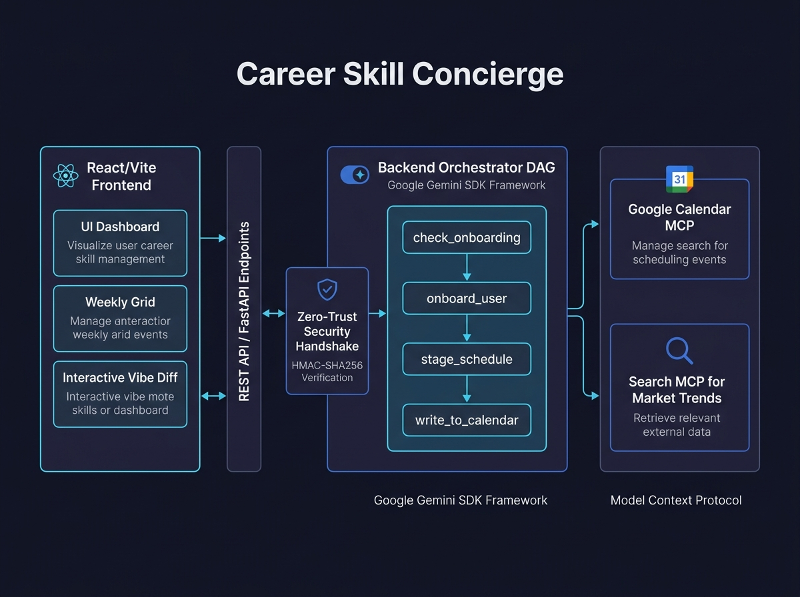

# Career Upskiller Concierge 🚀

An intelligent, secure agentic scheduling web application designed to help users balance career development with their busy personal lives. Powered by Google Gemini via the **Agent Development Kit (ADK)** and the **Model Context Protocol (MCP)**.

---

## 📌 The Problem
Modern professionals face a dual challenge when seeking to upskill or pivot careers:
1. **Time Scarcity & Burnout:** Calendars are congested with meetings, family obligations, and personal tasks. Finding dedicated time to learn is hard, and rigid plans often fail when unexpected conflicts arise.
2. **Security & Privacy Risks (Black-Box Agents):** Traditional calendar-scheduling AI agents demand broad read/write access to all user calendars. Exposing strictly private, family, or sensitive work calendars to an automated agent compromises security and user trust.

---

## 💡 The Solution
The **Career Upskiller Concierge** resolves these challenges by acting as a proactive and highly secure calendar partner:
* **Proactive Elicitation (Onboarding):** Walks the user through an onboarding wizard to discover goals, target weekly hours, and preferred study days.
* **Real-time Market Insights:** Leverages the **Search MCP** server to cross-reference the user's career goals with current hiring trends and automatically recommend focus areas.
* **Graceful Degradation:** If the calendar is dense with existing events, the scheduler automatically downgrades study blocks from large, intimidating periods to manageable "micro-learning" blocks.
* **Secure A2UI Zero-Trust Boundary:** Personal calendars remain completely hidden ("dark") from the AI. The system generates a cryptographic HMAC-SHA256 handshake token that pauses backend calendar write operations until the user interacts with, adjusts, and explicitly approves the proposed timeline.

---

## 🏗️ System Architecture

The application is structured into a clean decoupled frontend (React + Vite) and backend (FastAPI + ADK), coordinated via standard MCP protocols.



### Core Components:
1. **React / Vite Frontend (A2UI Boundary):**
   * **Onboarding Wizard:** Collects user parameters and whitelisted calendar targets.
   * **Timeline Grid Matrix:** Allows users to interactively drag-and-drop or resize the proposed learning events.
   * **Real-time Mirroring Dashboard:** Recalculates certificate completion projections and weekly target paces instantly as the user edits the timeline.
2. **FastAPI Backend Wrapper:**
   * Serves static assets, manages OAuth2 Google credentials, and hosts the REST API endpoints.
3. **ADK Orchestrator Workflow (DAG):**
   * Defines a Directed Acyclic Graph (DAG) using `google-adk` decorators:
     $$\text{START} \longrightarrow \text{check\_onboarding} \longrightarrow \begin{cases} \text{needs\_onboarding} \longrightarrow \text{onboard\_user} \\ \text{onboarded} \longrightarrow \text{stage\_schedule} \end{cases} \longrightarrow \text{write\_to\_calendar}$$
   * Pauses execution at `stage_schedule` using a `RequestInput` interrupt containing a cryptographic HMAC signature and transaction ID.
4. **Model Context Protocol (MCP) Integrations:**
   * **Search MCP Server:** For real-time market trends.
   * **Google Calendar MCP Server:** For fetching free/busy availability and safely writing authorized events.

---

## 🛠️ Setup & Execution Instructions

### Prerequisites
* **Node.js** (v18+ recommended)
* **Python** (v3.10+ with the Astral `uv` package manager installed)

---

### Step 1: Backend Setup
1. Clone the repository and navigate to the project directory:
   ```bash
   cd career-upskiller
   ```
2. Sync the Python environment and dependencies:
   ```bash
   uv sync
   ```
3. Start the FastAPI backend server:
   ```bash
   uv run python app/fast_api_app.py
   ```
   *Note: The backend runs with an OAuth2 credential fallback, so it will start up resiliently in mock-mode if GCP credentials are not yet configured.*

---

### Step 2: Frontend Setup
1. In a new terminal window, navigate to the frontend directory:
   ```bash
   cd frontend
   ```
2. Install the node dependencies:
   ```bash
   npm install
   ```
3. Start the Vite development server:
   ```bash
   npm run dev
   ```
4. Open the displayed URL in your browser (typically `http://localhost:5173`).

---

## 📝 Running Tests & Evals
The project includes a suite of unit, integration, and agent quality evaluation tests.

| Command | Purpose |
| :--- | :--- |
| `agents-cli playground` | Launches the local interactive web development playground. |
| `agents-cli lint` | Runs automated syntax and code quality checks. |
| `agents-cli eval` | Runs the agent behavior evaluation suite to measure quality. |
| `uv run pytest tests/unit tests/integration` | Runs the automated backend test suites. |

For detailed walkthroughs of scenario testing, refer to the [test_guide.md](file:///Users/christinewong/GitHub/career-upskiller/test_guide.md).
